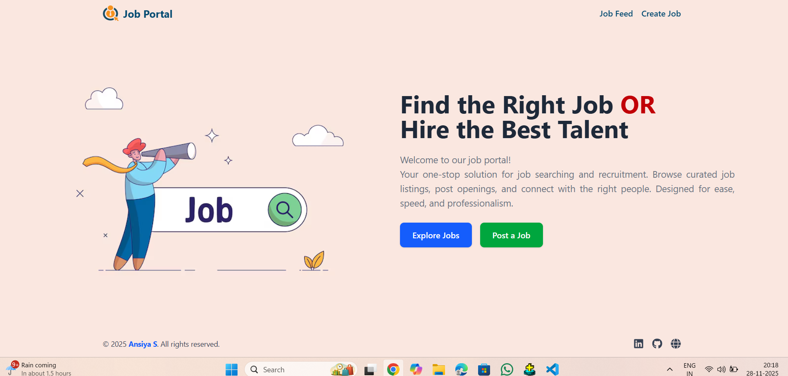
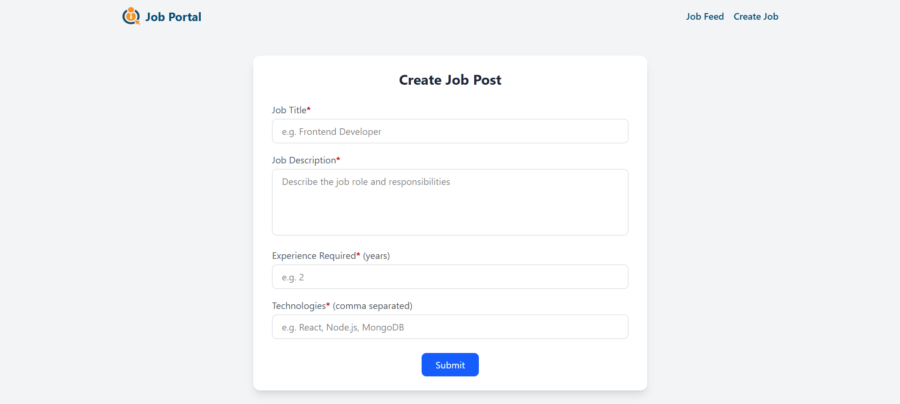
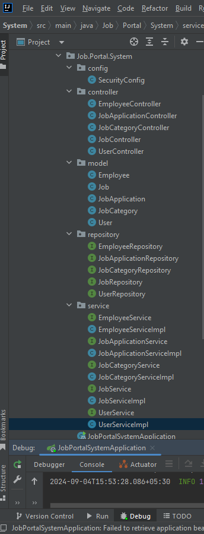
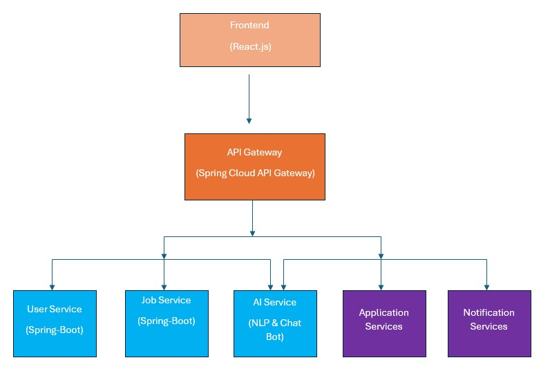

# 🌐 Internships & Job Management Web Portal

A full-stack web application designed to manage internships, job posting, candidate applications, and admin control.  
The platform helps students apply for jobs and internships, while employers can post opportunities and track applicants.

This project was developed as part of my **Zidio Internship Program**.

---

## 📖 Table of Contents

- [✨ Features](#-features)
- [🧰 Tech Stack](#-tech-stack)
- [📁 Project Architecture](#-project-architecture)
- [⚙️ Installation Guide](#️-installation-guide)
- [🛢️ Database Schema](#️-database-schema)
- [🖼 Screenshots](#-screenshots)
- [🚀 Future Improvements](#-future-improvements)
- [🧪 Testing](#-testing)
- [📌 Contribution Guidelines](#-contribution-guidelines)
- [📜 License](#-license)
- [🙌 Acknowledgment](#-acknowledgment)
- [📬 Contact](#-contact)

---

## ✨ Features

### 🔹 User Module (Job Seekers)
- Login & Register securely  
- Search & apply for internships or jobs  
- View application status (Approved / Rejected / Pending)  
- Manage resume and profile info  

### 🔹 Admin/Employer Module
- Post new jobs and internships  
- View candidate applications  
- Approve/Reject applications  
- Manage job listings  

### 🔹 System Features
- Responsive UI using Bootstrap  
- MVC architecture using Spring Boot  
- Form validation  
- Role-based authentication  

---

## 🧰 Tech Stack

| Category | Technology Used |
|---------|-----------------|
| Language | Java |
| Framework | Spring Boot |
| Frontend | HTML, CSS, Bootstrap, Thymeleaf |
| Backend | Spring Web, Spring Data JPA |
| Authentication | Spring Security (Optional/Extendable) |
| Database | MySQL |
| Build Tool | Maven |
| Version Control | Git & GitHub |

---

## 📁 Project Architecture
Internships-and-Job-Management-Web-Portal
│
├── src/main/java

│ ├── controller

│ ├── model

│ ├── service

│ ├── repository
│ └── config
│
├── src/main/resources
│ ├── templates (.html)
│ ├── static (CSS/Images)
│ └── application.properties
│
└── pom.xml

---

## ⚙️ Installation Guide

### 1️⃣ Clone Repository
git clone https://github.com/Anziya-s/Internships-and-Job-Management-Web-Portal-.git

cd Internships-and-Job-Management-Web-Portal-

### 2️⃣ Configure MySQL Database
spring.datasource.url=jdbc:mysql://localhost:3306/job_portal_db

spring.datasource.username=root

spring.datasource.password=yourpassword

spring.jpa.hibernate.ddl-auto=update

### 3️⃣ Run the Project

mvn spring-boot:run

👉 Application runs at: http://localhost:8080/

### 🛢️ Database Schema (Overview)

Table	Purpose

users	Stores user login and personal details

roles	Handles user roles (Admin/User)

jobs	Stores job/internship postings

applications	Tracks user job applications

## 📸 Screenshots

### 🏠 Home Page

  

---

### 🔐 Login Page

  

---

### 📄 Job Listings

  

---

### 📝 Apply Page

  

---

### 👤 Admin Dashboard

  

---

### 📦 BackEnd Project Structure

  

---

### 📝 Project Plan

  

### 🚀 Future Improvements

🔔 Email notification system

📊 Admin analytics dashboard

📁 Resume builder tool

🏢 Company HR Panel

### 🧪 Testing

Manual testing with user/admin roles

Bug fixing, validation checks

Tested UI responsiveness

### 📌 Contribution Guidelines

Pull requests are welcome. For major changes, please open an issue first to discuss.

### 📜 License

This project is developed for educational purposes and currently does not use any license.
You may modify or use the code with proper credit.

### 🙌 Acknowledgment

Thanks to Zidio Internship Program for guidance, mentorship, and opportunity.

### 📬 Contact

👤 Ansiya S

📧 Email: ansiyashihab9747@gmail.com

🔗 LinkedIn: https://www.linkedin.com/in/ansiya-s-62569a326/

